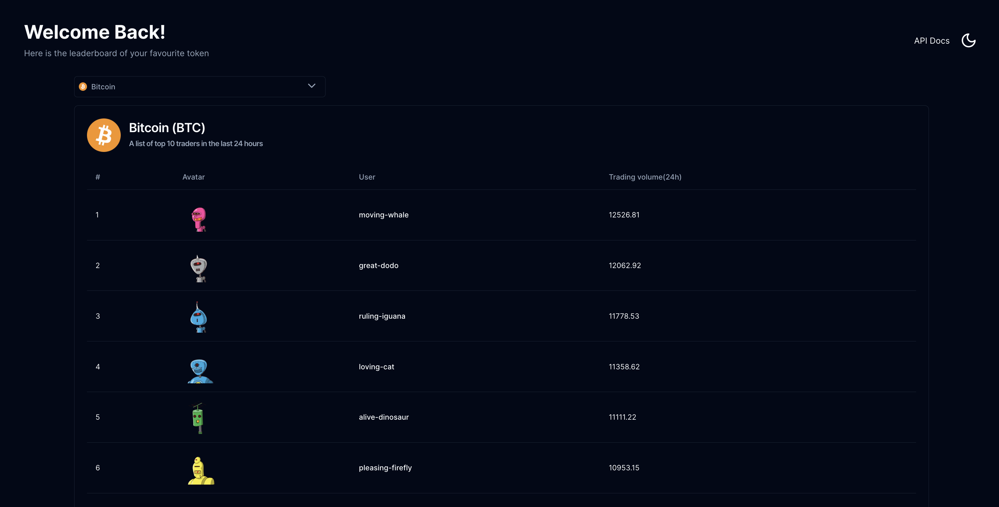
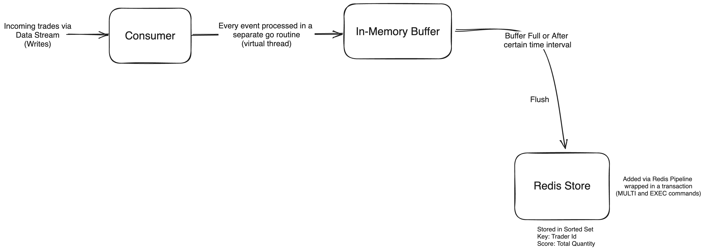
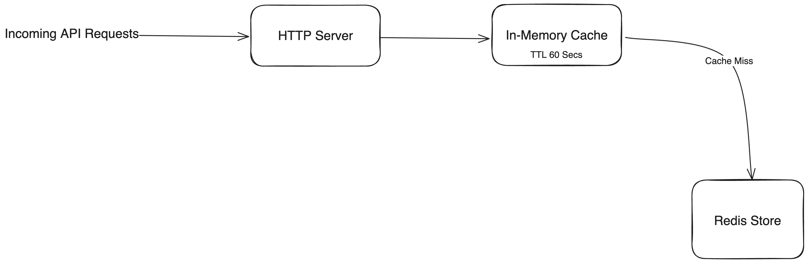

# Defx Coding Challenge - Trading Leaderboard
## Problem Statement
Write an efficient and scalable program that dynamically updates the leader-board with the latest ranking every minute, 
ensuring accuracy and performance even under high trading activity.

<p align=center>
    
</p>

## Tech Stack

**This project is also hosted and can be viewed at [leaderboard.pratikd.in](https://leaderboard.pratikd.in)**

### Backend
- Programming Language: GoLang
- Datastore: Redis
- Gin Web Framework
- Swagger for API Documentation
### Frontend
 - Programming Language: Javascript
 - Framework: Next JS 14 (React)
 - Styling: Tailwind CSS
 - UI Components: shadcn/ui
 - State Management: Jotai
## Architecture
The Architecture is divided into two parts:
### 1. Write Flow

It is assumed that the trading data is coming from a data stream (e.g., Kafka).
A Sorted Set in Redis is used to store and 
maintain the leaderboard.
Most sorted set operations are O(log(n)), where n is the number of members.
Under high trading 
activity, to minimize the number of writes and network round trips to redis, an In-Memory Local Buffer is maintained.
Every trade is written to the buffer first.
The buffer is flushed when it reaches its maximum capacity (currently set to 10 trades and is configurable) or after a 
certain time interval (currently set to 1 sec and is configurable).
It is ensured
that the buffer is flushed gracefully when the application receives a SIGINT or SIGTERM signal before exiting. 
At the time of buffer flush,
all the trades in it are written to redis via a pipeline, hence reducing the number of round trips to the Redis server. 
The pipeline is wrapped in a transaction (MULTI and EXEC commands).
The sorted set maintained in redis is expired at midnight every day.  

One caveat of the current system is that in an event of unexpected system failure,
the un-commited data in the buffer can be lost.
To counter this, a Write-Ahead Log (WAL) can be maintained where every trade will be written to it before adding to
the buffer.
When a server starts after a system failure, WAL logs will be replayed and any pending trades will be processed first
before starting the application.
It's not implemented in the current system due to the limited scope and as velocity is 
prioritized.

In the current setup, a mock producer is written that generates random trades and is consumed by the 
consumer.
This ensures that the leaderboard has some demonstrable entries.

### 2. Read Flow

The read flow is fairly simple.
Whe an API requests to get the leaderboard comes to the server, it's checked if the response
can be served via in-memory local cache.
If yes, the data from cache is returned as the response.
If no, the data is then queried from redis, cached to the cache store and is returned to the client
The cache store has a TTL of 60 Secs.
This setup ensures that even under high trading activity the response is returned with minimal latency.

## Running Locally
### Backend
The backend can be run locally in two ways
1. Docker Compose
2. Manually

#### 1. Docker Compose
Ensure that you have Docker and Docker Compose installed on your system For installation instructions refer:
https://docs.docker.com/install/
To start the server simply run 
```sh
docker compose up
```
This will start up the HTTP sever and Redis server. The backend server will be hosted at `127.0.0.1:8080 `

#### 2. Manually
Ensure that you have Go Lang version 1.22.0 and Redis installed. Start the Redis Server via ``redis-server`` command.
The Redis endpoint is currently set to `127.0.0.1:6379`. If you wish to modify this, change the value of `REDIS_ADDRESS` 
variable in `.env` file.  

Now start the backend by running the command
```sh
make run
```
Now the backend server will be hosted at `127.0.0.1:8080`

### Frontend
Ensure that you have Node.js installed on your system. Navigate to the `/frontend` folder and run `npm install` to install all the 
dependencies. Once done start the frontend by running the command:
```sh
npm run dev
```
The frontend will be accessible at [http://127.0.0.1:3000](http://127.0.0.1:3000) 
## Running Tests
To run the test cases, run the following command
```sh
make test
```
## API Documentation
The API documentation is hosted via Swagger
Once the server is up, visit [http://127.0.0.1:8080/swagger/index.html](http://127.0.0.1:8080/swagger/index.html)  
Additionally, the documentation can also be viewed by visiting [https://api-leaderboard.pratikd.in/swagger/index.html](https://api-leaderboard.pratikd.in/swagger/index.html)